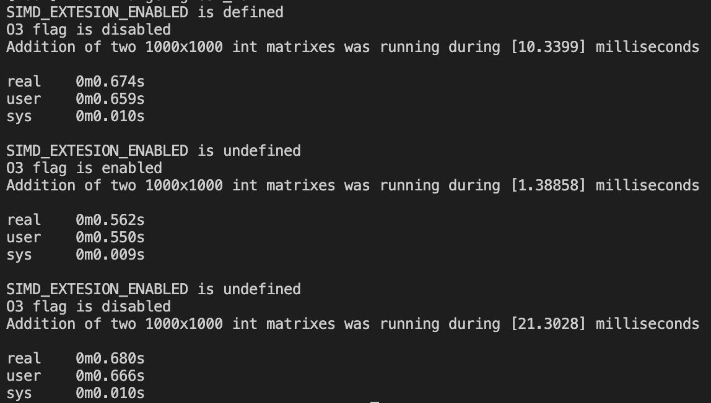

# IntMatrix.h with SSE extension
IntMatrix.h is simple std::vector<std::vector<int>> wrapper to represent matrixes.
IntMatrix.h uses SSE extension to speed up addition and substraction operations.

### Build
#### Mac M1
- brew for x86 is required
- cmake installed under x86 brew is required

To build under Rosetta 2 with SSE extension enabled. Script adds required defintions automatically.
```bash
./scripts/build_x86.sh
```
To build without SSE support use:
```bash
./scripts/build_arm64.sh
```
#### x86
- cmake is required
```
cmake . -Bbuild/x86 -DBUILD_X86_WITH_SSE=1
cmake --build build/x86
```

### Used SSE intrinsics
See this 
[guide](https://www.laruence.com/sse/#)

1. ```__m128i _mm_lddqu_si128 (__m128i const* mem_addr)```
2. ```__m128i _mm_sub_epi32 (__m128i a, __m128i b)```
3. ```__m128i _mm_add_epi32 (__m128i a, __m128i b)```
4. ```void _mm_storeu_si32 (void* mem_addr, __m128i a)```
5. ```__m128i _mm_bsrli_si128 (__m128i a, int imm8)```

### Testing
You could generate your own tests using script generateTestcases.py. To see usage run without parameters.
Paste generated tests into tests/test.cpp and build.

### Benchmarking
The following script build two versions of static library IntMatrix.h with support of custom SSE and without it. As second step, it builds three executables:
1. With -O3 and with custom SSE support
2. With -O3 and without custom SSE support
3. Without -O3 and without custom SSE support

As third step all executables run with time recording functions.
```
./scripts/runBenchmark.sh
```

### Сonclusions
1. Custom SSE twices perfomance comparing to code without compiler optimizations
2. -O3 flag still gives more perfomance because compiler seems to be using AVX

